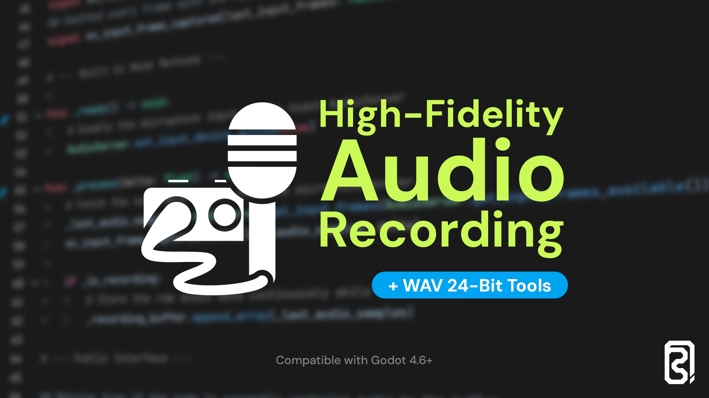

# High-Fidelity Audio Recording and WAV 24-Bit Tools for Godot 4.6+



A professional-grade audio suite designed to bypass engine-level audio input limitations and provide true 24-bit PCM support within Godot.

## 🚀 Solving the "Garbled Mic" Problem

Historically, audio input in Godot has been plagued by synchronization issues, leading to "robotic voice," "garbled audio," and significant input lag. These issues were deeply rooted in how the engine's high-level capture buses interacted with system drivers.

This module was specifically built to address the problems documented in the following GitHub issues:
* [Issue #76797](https://github.com/godotengine/godot/issues/112836): Audio input drift over time.
* [Issue #80173](https://github.com/godotengine/godot/issues/80173): Jitter and desync in audio capture.
* [Issue #112836](https://github.com/godotengine/godot/issues/112836): Persistent robotic/garbled input on certain hardware.

### The Solution: Low-Level Buffer Access
With the release of **Godot 4.6**, developers gained low-level access to the raw input device buffer ([PR #113288](https://github.com/godotengine/godot/pull/113288)). This plugin leverages that new capability to bypass the unstable high-level layers, capturing data directly from the hardware buffer for maximum stability and fidelity.

---

## ✨ Key Features

* **Direct Audio Input Recorder**: A custom node that captures microphone data without the jitter of standard buses.
* **24-Bit PCM Support**: Full support for 24-bit audio resources, providing 144dB of dynamic range (standard `AudioStreamWAV` is limited to 16-bit).
* **Streaming Playback Engine**: A high-performance player that decodes 24-bit chunks in real-time, preventing memory spikes.
* **Real-time Monitoring**: Built-in RMS and Peak volume calculation in Decibels (dB).
* **Pro WAV Exporting**: Saves audio to disk with a standard-compliant RIFF 24-bit header, compatible with Audacity, DAW, and professional audio software.

---

## 🛠 Installation

1.  Clone or copy the contents of this repository into your project's `res://addons/direct_audio_and_wav_24bits/` directory.
2.  Go to **Project > Project Settings > Plugins**.
3.  Locate **High-Fidelity Audio Recording and WAV 24-Bit Tools** and check the **Enabled** box.
4.  Ensure your project has **Audio Input** enabled in the Project Settings (under Audio).

---

## 🏗 Component Breakdown

### 1. DirectAudioInputRecorder (Node)
The "Heart" of the system. It monitors the `AudioServer` input frames and stores them in a floating-point buffer.
* **Stereo/Mono Toggle**: Automatically handles channel count.
* **Dynamic Mix Rate**: Supports 44.1kHz, 48kHz, or native device rates.
* **Stability**: Uses the Godot 4.6 direct buffer access to ensure no frames are dropped.

### 2. AudioStreamWAV24B (Resource)
A custom `Resource` class that manages the complex 24-bit byte encoding.
* **Sign Extension**: Uses professional bit-shifting logic (`(l_int << 40) >> 40`) to correctly map 24-bit signed integers into Godot's 64-bit integer space.
* **Little-Endian Encoding**: Ensures standard compatibility with Windows and standard PCM players.

### 3. AudioStreamPlayerWav24B (Node)
An optimized player inheriting from `AudioStreamPlayer`.
* **Streaming Architecture**: It does not decode the entire file at once. Instead, it "streams" chunks to an `AudioStreamGeneratorPlayback` object.
* **Low Memory Footprint**: Even for multi-minute recordings, only a few kilobytes are decoded per frame update.

---s

## 💻 Usage Example

```gdscript
extends Node

@onready var recorder = $DirectAudioInputRecorder
@onready var player = $AudioStreamPlayerWav24B

func _on_record_button_pressed() -> void:
    recorder.start_capturing()

func _on_stop_button_pressed() -> void:
    recorder.stop_capturing()
    var recording : AudioStreamWAV24B  = recorder.get_recording_as_wav24b()
    
    # Save it to the user folder
    recording.save_to_wav("user://high_fidelity_capture.wav")
    
    # Play it back immediately
    player.play_24bit(recording)
```

---

## 🧪 Technical References
This plugin relies on the following engine improvement:

Godot PR [#113288](https://github.com/godotengine/godot/pull/113288) - Added low-level audio input buffer access.

---

## 📜 License
This tool is provided under the MIT License. Use it to make your Godot games and apps sound incredible.
